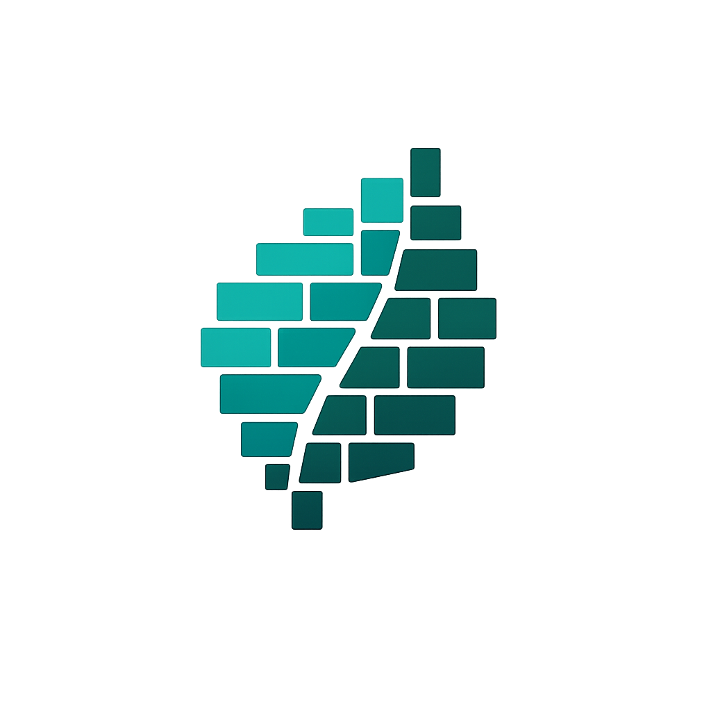

<p align="center">
  
</p>

# Thymeleaf Component Dialect

A Thymeleaf dialect for creating reusable UI components, similar to React or Vue components.

## Features

- **Reusable Components** – Define components with `th:fragment`, use them with `<tc:*>` tags
- **Named Slots** – Multiple content areas per component with `<tc:content name="...">` and `<tc:slot name="...">`
- **Fallback Content** – Default content for slots when none is provided
- **Constructor Parameters** – Pass parameters via `tc:constructor`
- **tc:once** – Deduplicate scripts and styles across multiple component instances
- **Attribute Replacement** – Dynamic attribute values with `tc:repl-*`
- **Spring Boot Auto-Configuration** – Just add the dependency, no setup needed

## Quick Example

**Component definition** (`templates/components/alert.html`):

```html
<div th:fragment="alert(type)" class="alert"
     th:classappend="'alert-' + ${type}">
    <tc:content></tc:content>
</div>
```

**Usage:**

```html
<tc:alert tc:constructor="'success'">
    <strong>Done!</strong> Your changes have been saved.
</tc:alert>
```

**Result:**

```html
<div class="alert alert-success">
    <strong>Done!</strong> Your changes have been saved.
</div>
```

## Next Steps

- [Getting Started](getting-started.md) – Installation and setup
- [Components](components.md) – Defining and using components
- [Named Slots](named-slots.md) – Multi-slot content projection
- [tc:once Attribute](once-attribute.md) – Deduplicate scripts and styles
